# 🧞‍♂️ Genie AI — Intelligent Multimodal AI Platform

[](https://nextjs.org/)
[](https://www.typescriptlang.org/)
[](https://tailwindcss.com/)
[](https://fastapi.tiangolo.com/)
[](https://www.python.org/)
[](https://pytorch.org/)
[](https://huggingface.co/)
[](LICENSE)

**Genie AI** is a production-ready, full-stack multimodal AI platform engineered for high-performance reasoning, real-time vision perception, voice intelligence, and deep neural inspection. Featuring a modern dark-mode interface inspired by ChatGPT, Genie AI seamlessly unifies **Large Language Models (LLMs)**, **Vision-Language Models (VLMs)**, **Diffusion Models**, and **Audio Speech Models** with local zero-API offline execution and enterprise cloud endpoints.

---

## 🤖 Models Deployed in Genie AI

Genie AI integrates a multi-tier model matrix spanning local keyless transformers, high-throughput cloud endpoints, vision foundation models, diffusion generation, and whisper speech recognition:

### 1. 🧠 Large Language Models (LLMs)

| Model Name | Model ID / Identifier | Source / Provider | Parameters | Execution Type | Primary Capabilities |
|---|---|---|---|---|---|
| **Qwen 2.5 0.5B Instruct** | `Qwen/Qwen2.5-0.5B-Instruct` | Hugging Face Transformers | 0.5 Billion | **Local (100% Free & Keyless)** | Default zero-API local chat, low memory footprint, CPU/GPU `bfloat16` inference, instant streaming. |
| **Qwen 2.5 1.5B Instruct** | `Qwen/Qwen2.5-1.5B-Instruct` | Hugging Face Transformers | 1.5 Billion | **Local (PyTorch / CUDA)** | Step-by-step auto-regressive generation, deep reasoning, LLM X-Ray neural inspection & attention telemetry. |
| **Llama 3.3 70B Versatile** | `llama-3.3-70b-versatile` | Groq Cloud | 70 Billion | **Hosted Cloud API** | High-speed cloud reasoning, complex code generation, long-context conversational assistance. |
| **Qwen 2.5 Coder 32B** | `qwen-2.5-coder-32b` | Groq / OpenRouter | 32 Billion | **Hosted Cloud API** | Specialized code syntax generation, refactoring, algorithms, multi-language software development. |
| **OpenAI GPT-4o Mini** | `gpt-4o-mini` | OpenAI Cloud API | Compact MoE | **Hosted Cloud API** | Fast, high-accuracy conversational reasoning, knowledge retrieval, and structured JSON generation. |
| **OpenAI GPT-4o** | `gpt-4o` | OpenAI Cloud API | Flagship Omni | **Hosted Cloud API** | Advanced logic, code synthesis, mathematical derivations, and agentic workflows. |
| **Google Gemini 1.5 Flash** | `gemini-1.5-flash` | Google AI Studio / Cloud | Multimodal Flash | **Hosted Cloud API** | Rapid response generation, ultra-long context window support, and real-time knowledge synthesis. |
| **DeepSeek R1** | `deepseek-r1` | OpenRouter Cloud | 671B MoE | **Hosted Cloud API** | Open-weights reasoning, formal mathematical derivations, and Chain-of-Thought (CoT) problem solving. |

---

### 2. 👁️ Vision-Language Models (VLMs) & Visual Intelligence

| Model Name | Model ID / Engine | Source / Provider | Tasks Supported | Implementation Details |
|---|---|---|---|---|
| **Microsoft Florence-2 Large** | `microsoft/Florence-2-large` | Hugging Face Transformers | `<MORE_DETAILED_CAPTION>`, `<OD>`, `<OCR>`, `<VQA>` | 0.77B vision foundation model for dense visual captioning, object detection with bounding boxes, and camera scene QA. |
| **Microsoft Florence-2 Base** | `microsoft/Florence-2-base` | Hugging Face / PyTorch | `<DETAILED_CAPTION>`, `<OCR_WITH_REGION>` | Lightweight vision model running on CPU/GPU (`float16`/`float32`) for rapid spatial analysis. |
| **On-Device Local OCR Engine** | `tesseract.js` / WebWorker | Client-Side Browser Engine | Optical Character Recognition | **100% Private, Zero-API OCR**. Extracts printed and handwritten text from documents, exam papers, and invoices without network leakage. |

---

### 3. 🎨 Diffusion & Generative Vision Models

| Model Name | Model ID | Source / Provider | Architecture | Use Case |
|---|---|---|---|---|
| **SANA 1.6B** | `sana-1.6b` | Diffusion Pipeline / Generative Studio | Deep Linear Attention Diffusion Transformer | High-resolution text-to-image synthesis, interactive creative concept visualization directly in chat. |

---

### 4. 🎙️ Audio & Speech Models

| Model Name | Model ID | Engine | Optimization | Capabilities |
|---|---|---|---|---|
| **Faster-Whisper** | `faster-whisper` (Base / Medium) | CTranslate2 + PyTorch | `INT8` Quantization (CPU & GPU) | Ultra-fast audio transcription with automatic language identification, timestamps, and punctuation. |
| **Web Speech Recognition** | Native Web Speech API | Client Browser Engine | Zero Latency Streaming | Conflict-free real-time microphone voice typing with live visual waveform and token generation. |

---

### 5. 🔬 Neural Inspection & Embedding Models (LLM X-Ray)

| Component | Model / Technology | Functionality |
|---|---|---|
| **Hidden Layer Projections** | PyTorch Forward-Pass Hooks | 2D/3D PCA decomposition of high-dimensional token representations across 28+ transformer layers. |
| **Multi-Head Attention Maps** | Attention Matrix Extractors | Heatmaps displaying query-key attention distribution per head and layer drift comparison. |
| **Logits & Probabilities** | Softmax Distribution Tracker | Top-K candidate probabilities and token perplexity analysis during auto-regressive decoding. |

---

## 🌟 Key Architecture & Features

- **⚡ Multi-Model Switching**: Switch seamlessly between local keyless models (`Qwen 2.5 0.5B/1.5B`) and cloud APIs (`Groq`, `OpenAI`, `Gemini`, `DeepSeek`) on the fly.
- **👁️ Live Camera Snapshot & Vision**: Open the `CameraModal` to capture snapshots through your webcam and query Florence-2 or OCR for instant answers.
- **📚 RAG Knowledge Retrieval**: Ingest and query **PDF**, **DOCX**, **TXT**, **CSV**, and **JSON** files with exact page citations (e.g., `[Document.pdf, Page 3]`).
- **🎙️ Real-time Voice Typing**: Dictate prompts naturally with microphone integration and automatic transcription.
- **🧠 Persistent Long-Term Memory**: Genie AI preserves custom persona details, instructions, and user preferences across chat sessions via `MemoryModal`.
- **🛡️ Enterprise Security**: JWT Bearer token authentication, Google OAuth 2.0 Web SDK integration, guest access mode, and bcrypt password hashing.
- **🎨 Modern Dark UX**: Responsive sidebar, conversation history search, rename & delete, syntax-highlighted code blocks with single-click copy, and markdown tables.

---

## 🏗️ Architecture Flow

```mermaid
flowchart TD
    subgraph Frontend ["Next.js 14 Web Client"]
        Chat["Chat Interface & SSE Stream"]
        Cam["CameraModal & Vision UI"]
        Voice["Voice Input / Web Speech"]
        Docs["RAG Document Drawer"]
        Memory["MemoryModal (Long-term Context)"]
        OCR["On-Device Tesseract OCR"]
    end

    subgraph Backend ["FastAPI Application (/api)"]
        APIRouter["API Gateway & Middleware"]
        AuthService["Auth (JWT + Google OAuth 2.0)"]
        LLMService["LLM Multi-Provider Service"]
        VisionRouter["Vision & Florence-2 Pipeline"]
        AudioRouter["Faster-Whisper Audio Pipeline"]
        RAGRouter["Document Chunking & Vector Search"]
        Database[(SQLite / PostgreSQL)]
    end

    subgraph Models ["Model & Provider Ecosystem"]
        LocalLLM["Qwen 2.5 0.5B / 1.5B (Local Keyless)"]
        GroqCloud["Llama 3.3 70B & Qwen Coder (Groq)"]
        OpenAICloud["GPT-4o / GPT-4o Mini (OpenAI)"]
        GeminiCloud["Gemini 1.5 Flash (Google)"]
        DeepSeekCloud["DeepSeek R1 (OpenRouter)"]
        Florence2["Microsoft Florence-2 (VLM)"]
        Whisper["Faster-Whisper (Audio)"]
        Sana["SANA 1.6B (Diffusion)"]
    end

    Chat --> APIRouter
    Cam --> APIRouter
    Voice --> APIRouter
    Docs --> APIRouter
    Memory --> APIRouter
    Cam --> OCR

    APIRouter --> AuthService
    APIRouter --> LLMService
    APIRouter --> VisionRouter
    APIRouter --> AudioRouter
    APIRouter --> RAGRouter

    AuthService --> Database
    LLMService --> LocalLLM
    LLMService --> GroqCloud
    LLMService --> OpenAICloud
    LLMService --> GeminiCloud
    LLMService --> DeepSeekCloud
    VisionRouter --> Florence2
    AudioRouter --> Whisper
```



---

## 📂 Project Directory Structure

```
Genie-AI/
├── backend/
│   ├── app/
│   │   ├── api/
│   │   │   ├── audio.py          # Faster-Whisper audio transcription endpoints
│   │   │   ├── auth.py           # Signup, login, Google OAuth, guest access
│   │   │   ├── chat.py           # Multi-turn SSE streaming, conversation CRUD
│   │   │   ├── settings.py       # User profile & API key configuration
│   │   │   ├── upload.py         # Document ingestion (PDF, DOCX, TXT, CSV, JSON)
│   │   │   └── vision.py         # Microsoft Florence-2 vision & image analysis
│   │   ├── core/
│   │   │   ├── config.py         # Genie AI app configuration & environment
│   │   │   ├── database.py       # SQLAlchemy engine & session factory
│   │   │   └── security.py       # Bcrypt password hashing & JWT token validation
│   │   ├── models/
│   │   │   ├── chat.py           # Conversation & Message database models
│   │   │   ├── document.py       # Document & Chunk schemas
│   │   │   └── user.py           # User & Auth models
│   │   ├── services/
│   │   │   ├── llm_service.py    # Local Qwen + Cloud LLM streaming service
│   │   │   └── rag_service.py    # Document parsing, chunking & similarity search
│   │   └── main.py               # FastAPI server entry point
│   ├── requirements.txt          # Backend Python dependencies
│   └── .env.example
├── frontend/
│   ├── src/
│   │   ├── app/
│   │   │   ├── layout.tsx        # Global layout & metadata (Genie AI branding)
│   │   │   ├── page.tsx          # Main chat application page
│   │   │   ├── login/page.tsx    # Authentication page
│   │   │   ├── register/page.tsx # User registration
│   │   │   └── settings/page.tsx # User settings & preferences
│   │   ├── components/
│   │   │   ├── CameraModal.tsx   # Live camera snapshot & vision modal
│   │   │   ├── ChatInput.tsx     # Rich chat input with voice & attachments
│   │   │   ├── ChatWindow.tsx    # Streaming chat bubbles, markdown & code
│   │   │   ├── CodeBlock.tsx     # Syntax highlighting with one-click copy
│   │   │   ├── DocumentDrawer.tsx# RAG document uploader & manager
│   │   │   ├── GoogleAuthButton.tsx # Google OAuth 2.0 button
│   │   │   ├── Header.tsx        # Model selector, dark mode & user profile
│   │   │   ├── MemoryModal.tsx   # Persistent memory inspector
│   │   │   ├── SanaImageCard.tsx # SANA 1.6B image generation display
│   │   │   ├── Sidebar.tsx       # Conversation history, search, rename, delete
│   │   │   └── SplashScreen.tsx  # Interactive onboarding splash
│   │   ├── lib/
│   │   │   ├── api.ts            # Axios instance & SSE stream reader
│   │   │   ├── auth.ts           # Client token storage manager
│   │   │   └── florence_engine.ts# Florence-2 task label resolver & local VLM logic
│   │   └── types/
│   │       └── index.ts          # TypeScript interfaces & types
│   ├── package.json
│   ├── tailwind.config.js
│   └── tsconfig.json
├── app.py                        # Streamlit LLM X-Ray neural inspection interface
├── model.py                      # Local PyTorch attention & hidden layer extraction engine
├── tokenizer.py                  # Tokenizer utilities & HTML chip generator
├── visualization.py              # Plotly 2D/3D PCA & attention heatmap visualizations
├── deploy-firebase.ps1           # Automated Firebase deployment script
├── firebase.json                 # Firebase Hosting configuration
├── render.yaml                   # Render deployment configuration
└── README.md
```

---

## ⚡ Quickstart Guide

### Prerequisites
- **Node.js**: `v18.0.0` or higher
- **Python**: `3.10` or higher
- **Git**: Installed and configured

---

### 1. Backend Setup

```bash
# Navigate to backend directory
cd backend

# Create and activate Python virtual environment
# Windows (PowerShell):
python -m venv .venv
.venv\Scripts\Activate.ps1

# Linux / macOS:
python3 -m venv .venv
source .venv/bin/activate

# Install dependencies
pip install -r requirements.txt

# Create environment file
cp .env.example .env

# Start FastAPI development server
python -m uvicorn app.main:app --reload --port 8000
```

- API Server: `http://localhost:8000`
- Interactive Swagger Docs: `http://localhost:8000/docs`
- Alternative Redoc: `http://localhost:8000/redoc`

---

### 2. Frontend Setup

```bash
# Open a new terminal and navigate to frontend directory
cd frontend

# Install Node dependencies
npm install

# Start Next.js development server
npm run dev
```

- Web Application: **`http://localhost:3000`**

---

### 3. Optional: LLM X-Ray Neural Telemetry (Streamlit)

To run the interactive transformer attention and hidden-layer inspection suite:

```bash
pip install -r requirements.txt
streamlit run app.py
```

---

## 🔐 Environment Variables

### Backend (`backend/.env`)

| Variable | Description | Default |
|---|---|---|
| `PROJECT_NAME` | Platform name | `Genie AI` |
| `DATABASE_URL` | SQLAlchemy connection string | `sqlite:///./genie_ai.db` |
| `SECRET_KEY` | Secret key for JWT signing | *Auto-configured in setup* |
| `GROQ_API_KEY` | API Key for Groq Cloud (`Llama 3.3 70B`, `Qwen Coder`) | `""` (Falls back to local Qwen) |
| `OPENAI_API_KEY` | API Key for OpenAI (`GPT-4o`, `GPT-4o Mini`) | `""` |
| `GEMINI_API_KEY` | API Key for Google Gemini (`Gemini 1.5 Flash`) | `""` |
| `OPENROUTER_API_KEY` | API Key for OpenRouter (`DeepSeek R1`) | `""` |
| `GOOGLE_CLIENT_ID` | Client ID for Google OAuth 2.0 Web Sign-In | `""` |
| `GOOGLE_CLIENT_SECRET` | Client Secret for Google OAuth | `""` |

### Frontend (`frontend/.env.local`)

| Variable | Description | Default |
|---|---|---|
| `NEXT_PUBLIC_API_URL` | Base URL for FastAPI backend | `http://localhost:8000/api` |
| `NEXT_PUBLIC_GOOGLE_CLIENT_ID` | Google OAuth Client ID for Web | `""` |

---

## 🌐 Deployment

### Frontend (Firebase Hosting or Vercel)
- **Firebase Hosting**:
  ```powershell
  # Automated build and deploy script
  .\deploy-firebase.ps1
  ```
  Or manually:
  ```bash
  cd frontend
  npm run build:firebase
  firebase deploy --only hosting
  ```
- **Vercel**: Import the `frontend` directory into Vercel and configure `NEXT_PUBLIC_API_URL`.

### Backend (Render / Railway / Fly.io / VPS)
- Deploy the `backend` folder as a Python web service.
- **Build Command**: `pip install -r requirements.txt`
- **Start Command**: `uvicorn app.main:app --host 0.0.0.0 --port $PORT`
- Set your production environment variables (`DATABASE_URL`, `SECRET_KEY`, LLM API keys).

---

## 🔄 Syncing Git Remote with Genie AI

If you rename your repository on GitHub to `Genie-AI`:

1. Go to your GitHub repository: `https://github.com/ruthwin09/LLMPROJ/settings`
2. Under **General** > **Repository name**, enter **`Genie-AI`** (or `GenieAI`) and click **Rename**.
3. Update your local git remote URL:
   ```bash
   git remote set-url origin https://github.com/ruthwin09/Genie-AI.git
   ```
4. Verify your remote configuration:
   ```bash
   git remote -v
   ```

---

## 📄 License

This project is licensed under the [MIT License](LICENSE).
